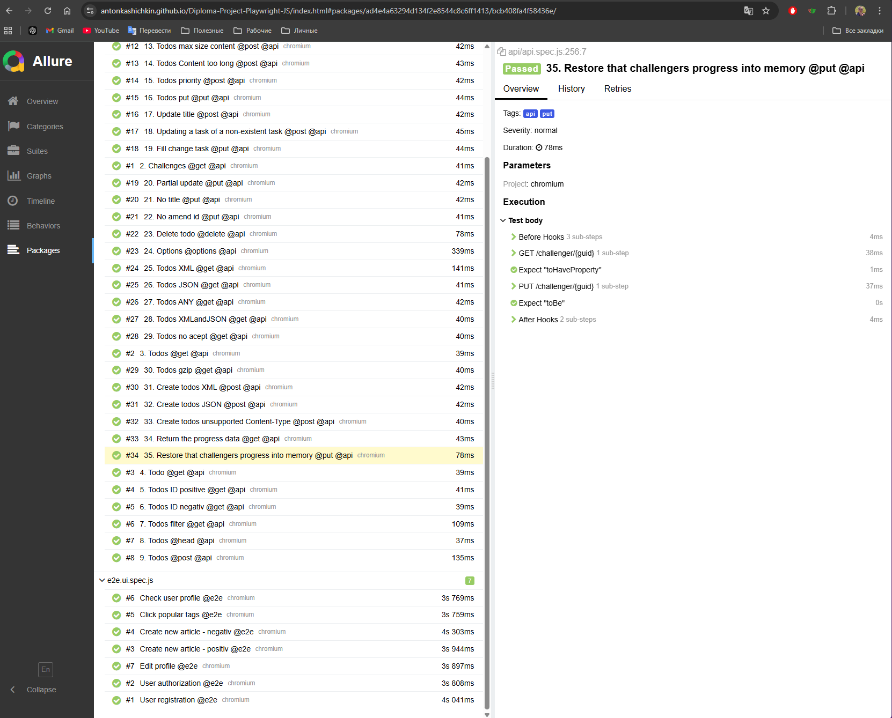
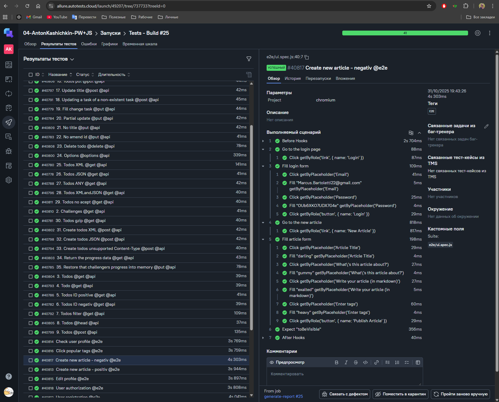
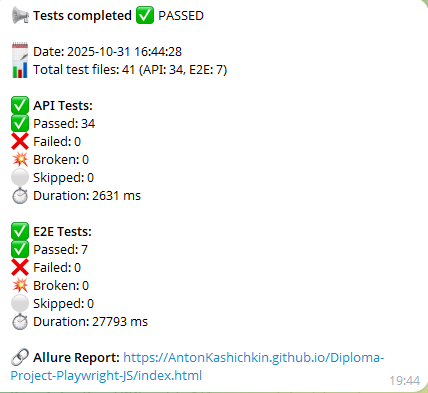

<h1 align="center">Дипломный проект по автоматизации тестирования JS+PlayWright</h1>

##  Содержание:
- <a href="#description"> Описание</a>
- <a href="#techStack"> Технологический стек</a>
- <a href="#installPlaywright"> Установка Playwright</a>
- <a href="#autotests"> Запуск автотестов</a>
- <a href="#generateAllureReport"> Генерация отчетов</a>
- <a href="#allureReport"> Пример Allure-отчета</a>
- <a href="#allureTestOpsReport"> Пример Allure TestOps-отчета</a>
- <a href="#tg"> Уведомления в Telegram с использованием бота</a>


<a id="description"></a>
## 📝 Описание
Проект представляет собой набор автоматизированных тестов <code>api</code> и <code>e2e</code>, написанных на языке программирования <code>JavaScript</code> с использованием фреймворков <code>[Playwright](https://playwright.dev)</code> и <code>[Allure](https://allurereport.org/)</code>. Playwright предоставляет мощный инструментарий для веб-автоматизации, а Allure добавляет возможности для хорошо читаемой отчетности.

В проекте использованы такие патерны как: <code>Page Object Model</code>, <code>Facade</code>, <code>Fixture</code>.
Для генерации рандомных значений используется <code>[Fakerjs](https://fakerjs.dev/)</code>.
Тесты разделены на API и E2E тегами, что позволяет запускать тесты отдельно.

Для удаленного запуска реализована джоба в <code>Github</code> action с формированием Allure-отчета и отправкой результатов в <code>Allure TestOps</code> и <code>Telegram</code> при помощи бота.

<a id="techStack"></a>
## 🛠 Технологический стек
- **JavaScript** — язык программирования для написания автоматизированных тестов
- **Playwright** — фреймворк для кросс-браузерного тестирования веб-приложений
- **GitHub** — платформа для хранения кода и совместной разработки
- **GitHub Actions** — инструмент CI/CD для автоматизации процессов через GitHub, в том числе для быстрых прогонов при PR
- **Allure Report** — система визуализации результатов тестирования
- **Telegram** — мессенджер, позволяющий автоинформировать заинтересованных лиц о результатах запусков тестов


<a id="installPlaywright"></a>
____
## 🚀Установка
Клонируем репозиторий на локальную машину
```
git clone https://github.com/AntonKashichkin/Diploma-Project-Playwright-JS.git
```
Устанавливаем **node.js**:
```
npm install
```
Инициализируем проект **playwright**:
```
npm init playwright@latest
```

<a id="autotests"></a>
____
## ▶️ Запуск тестов, генерация отчета

### Локальный запуск тестов из терминала

Запуск всех тестов:
```
npm run test
```
Запуск API тестов:
```
npm run testAPI
```
Запуск UI тестов:
```
npm run testE2E
```

<a id="generateAllureReport"></a>
_____
### Локальная генерация отчета Allure из терминала

Генерация отчета:
```
npm run allureReport
```
Генерация отчета с открытием в браузере:
```
npm run allureServe
```
---

____
<a id="allureReport"></a>
##  </a> Пример Allure-отчета </a>
<p align="center">

</p>

____
<a id="allureTestOpsReport"></a>
##  </a> Пример Allure TestOps-отчета </a>
<p align="center">

</p>

____
<a id="tg"></a>
##  Уведомления в Telegram
После завершения тестов бот, подключенный к <code>Telegram</code>, автоматически собирает результаты тестов и отправляет сообщение с отчетом о прохождении тестов в чат. Отчет разделен на 3 части: Общее количетво пройденных тестов, api и e2e тесты с затраченным временем и информацией о пройденных тестах.
<div style="background-color: #18222d">
<p align="center">

</p>
</div>